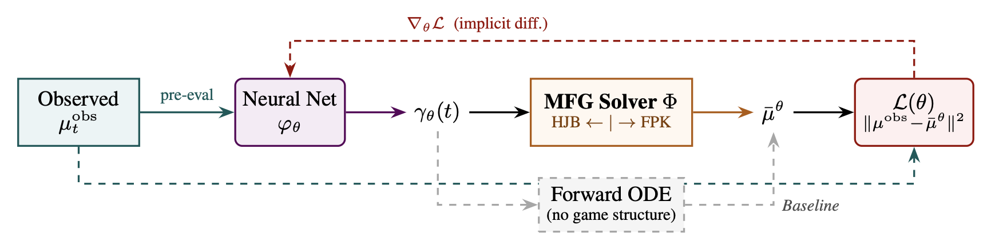

# Neural parameter calibration for mean field games
We present a neural network-based framework for calibrating the parameters within finite-state mean field games (MFGs) from observations. The method formulates the calibration as an inverse problem and uses implicit differentiation to backpropagate through the equilibrium of the MFG.

### Overview
We use a neural network $\varphi_\theta$ to learn and pre-evaluate the parameter estimations $\gamma_\theta$ from previous observations $\mu_t^{obs}$. The neural network parameters are optimized by minimizing the $L2$ loss between the observations ($\mu_t^{obs}$) and predictions ($\bar\mu^{\theta}$). 

The parameter estimates are optimized by backpropagating through the MFG equilibrium. Doing so, the original MFG dynamics, which are governed by the minimization of the players' cost function, are preserved. 



### Installation & Quick start
This project is based on JAX ecosystem for training neural networks. For most purposes, the CPU-based installation of JAX suffices. 

We recommend using `uv` to configure your virtual environment, but using `pip` or `conda` is certainly possible too! All instructions are provided below. 

```shell
# Clone the repository
git clone https://github.com/Racemuis/MFGParameterCalibration
# Install uv if you haven't already
curl -LsSf https://astral.sh/uv/install.sh | sh  

# If your system doesn't have curl, you can use wget or pip to install it
# wget -qO- https://astral.sh/uv/install.sh | sh
# pip install uv

# Create environment and install ECHO
cd MFGParameterCalibration
uv venv --python 3.11
source .venv/bin/activate  # On Windows: .venv\Scripts\activate
uv pip install -e .
# Alternatively, you can install the requirements using pip
# pip install -r requirements.txt
```

### Experiments
All experiments are provided in the `./experiments/` folder, and are initialized with the same hyperparameters as used in the paper. You can run all experiments as a module, for example, by calling 

```bash
python -m experiments.linear_quadratic.mean_field_game
```

to run the MFG variant of the linear quadratic experiment.

#### Downloading the data
This repository features two experiments that are based on real-world data, that can be obtained as follows:

| Experiment                  | Dataset                  | URL                                                  | License                                                                     |
|-----------------------------|--------------------------|------------------------------------------------------|-----------------------------------------------------------------------------|
| `experiments/SIR/nrevss.py` | Influenza (NREVSS)       | https://www.cdc.gov/nrevss/php/dashboard/index.html/ | [Public Domain (U.S. Government)](https://www.usa.gov/government-copyright) |
| `experiments/bikeshare`     | Citi Bike Trip Histories | https://citibikenyc.com/system-data                  | [NYCBS Data Use Policy](https://citibikenyc.com/data-sharing-policy)                                                   |


